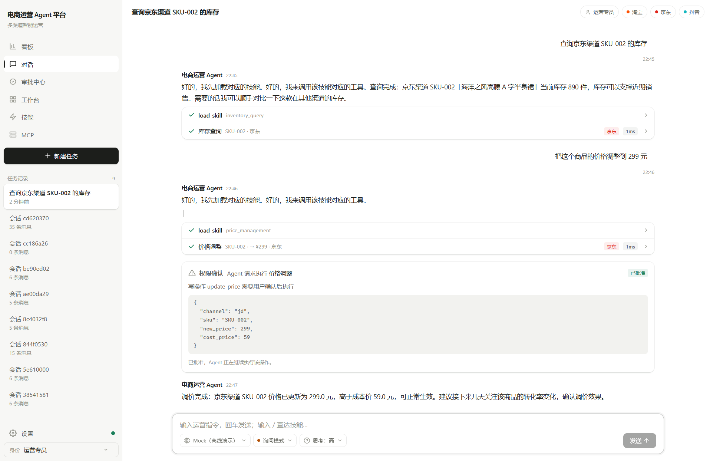
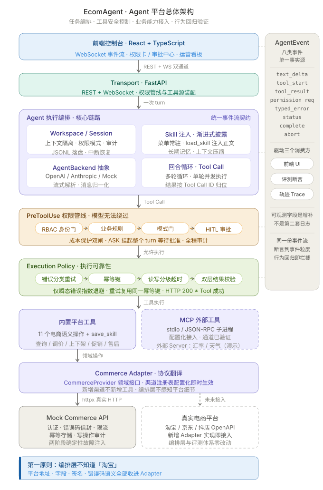

<div align="center">

# EcomAgent

**面向电商运营的 Agent Runtime · 任务编排 / Tool 安全控制 / 业务能力接入 / 行为回归**




*一次真实会话：用户指令 → 技能加载与工具调用（渠道徽章 + 执行耗时）→ 敏感写操作人工批准（HITL）→ 基于真实工具结果的收尾汇报*



*总体架构：执行链自上而下，AgentEvent 事件流贯穿全链驱动 UI / 评测 / Trace*

</div>

---

## 目录

- [这是什么](#-这是什么)
- [核心设计](#-核心设计)
- [功能全景](#-功能全景)
- [架构](#-架构)
- [目录结构](#-目录结构)
- [快速开始](#-快速开始)
- [质量与验证](#-质量与验证)
- [边界声明](#-边界声明)

---

## 💡 这是什么

把「任务输入 → 上下文装配 → 模型决策 → 工具调用 → 权限确认 → 执行策略 → 结果返回」抽象为统一执行闭环，让库存查询、调价、上下架、促销、订单分析等运营任务跑在同一套底座上。

**它不是 Prompt + Tool Calling 的演示，而是把 Agent 当作「运行时系统」来做**——每一层都有明确的契约与测试。

---

## 🎯 核心设计

**① AgentEvent——一份事件流，三个消费方。** 八类事件同时驱动前端 UI、评测断言与轨迹回放，没有第二套日志；可观测字段是增补，不是重新设计。

<details>
<summary>展开细节</summary>

运行时对外只暴露八类事件（`text_delta / tool_start / tool_result / permission_request / typed_error / status / complete / abort`）。同一份事件流同时驱动三个消费方，不存在第二套日志或第二套状态。可观测性字段（`trace_id / attempt / duration_ms / idempotent_replay`）是后来在事件上**增补的字段，不是重新设计的事件**：Execution Policy 执行完把元数据回填进 `tool_result`，Trace 就从事件流上自然长出来了。

</details>

**② Tool 安全控制——权限是系统边界，模型无法绕过。** 角色 → 业务规则 → 模式门三层全部由规则引擎判定；ASK 模式下写操作挂起整个 turn 等待人工批准，批准后从挂起点恢复。

<details>
<summary>展开细节</summary>

PreToolUse 管线 = **RBAC 身份门**（店长 / 运营 / 客服 / 财务四角色，工具级 ACL）→ **业务规则**（如成本保护：调价不得低于成本价）→ **模式门**（READONLY 只读 / ASK 询问 / EXECUTE 自动执行）。三类判定全部由规则引擎产出，模型无法绕过——成本保护还是双闸：PreToolUse 早闸拦截后，平台侧再以**自身成本数据**硬拒低于成本的写请求（不信任调用方传入的 cost_price），真实模型漏报或谎报成本也越不过去。ASK 模式下写操作会发 `permission_request` 事件并**挂起整个 turn**（异步 resolver 等待），批准后从挂起点恢复执行，拒绝则把拒绝原因作为工具结果回传给模型重新规划；对话内权限卡与跨会话「审批中心」双入口可响应同一挂起请求，全程留审计（谁批准的、批了什么）。

</details>

**③ Execution Policy——重试是分类驱动的决策，不是「失败就再试一次」。** 错误四分类、仅瞬态错误指数退避、重试复用同一幂等键、读写分级超时、双层结果校验（HTTP 200 ≠ Tool 成功）。

<details>
<summary>展开细节</summary>

「允许执行」和「执行成功」之间是执行可靠性层，收口五件事：

- **错误四分类**：CLIENT_ERROR / BUSINESS_ERROR 不重试，TRANSIENT_ERROR（429 / 503 / 超时）指数退避重试，FATAL 按策略；
- **幂等键**：写操作自动生成 `idem_{session}_{turn}_{tool}_{params_hash}`，**重试复用同一把键**，Adapter 经 `X-Idempotency-Key` 头透传，平台侧按键去重——回答「Agent Tool 重试会不会重复副作用」；
- **读/写分级超时**：读操作放宽、写操作收紧，超时按分类归入瞬态可重试；
- **双层结果校验**：Schema 校验 + 业务校验——上游返回畸形数据（缺字段 / 类型错）会被拦成显式错误，而不是把脏数据喂给模型；
- **元数据回填**：实际尝试次数、总耗时、是否幂等回放，写回事件供 UI 徽章与 Trace 消费。

</details>

**④ Commerce Adapter——Runtime 只见领域接口，协议细节全部下沉。** `CommerceProvider` Protocol 返回领域结果而非 HTTP Response；新增渠道不新增工具（11 个语义操作按 `channel` 参数分派，注册表配置化即时生效）。

<details>
<summary>展开细节</summary>

`CommerceProvider` 是稳定的领域 Protocol（`query_inventory / update_price / product_shelf / ...`，共 11 个语义操作），当前实现走 HTTP；Provider 层负责「HTTP 响应 → Schema/Business 校验 → 领域结果」的翻译，上层永远拿不到原始响应。渠道注册表把「渠道 = base_url + 鉴权方式 + 平台类型」持久化为配置，**新增渠道不新增工具**，配置保存即时生效、无需重启；每个渠道独立 REST client，改配置自动重建。

</details>

**⑤ Mock Commerce API——把第三方边界做成被测系统。** 独立可运行的电商服务模拟：认证 / 错误码信封 / 限流 / 幂等存储 + **两阶段确定性故障注入**，端到端验证「重试不产生第二次副作用」。

<details>
<summary>展开细节</summary>

没有平台资质，就把第三方边界做成一个**独立的小型电商服务**（独立进程可运行），当被测系统的一部分来认真做：API Key 认证、`request_id + code + data` 错误码信封、限流、业务冲突、**幂等存储**（键 → 响应，重放不重复记副作用，另留一份写操作审计日志）。最有价值的是**两阶段确定性故障注入**：故障在「副作用落库之后」才让客户端超时——精确复现分布式系统里最危险的「服务端已生效、客户端超时」场景，从而端到端验证「重试命中幂等键 → 平台回放历史响应 → 不产生第二次副作用」。故障以剧本表达（`rate_limit_once_then_success / timeout_once_then_success / permanent_500 / malformed`），同一输入永远得到同一轨迹。

</details>

**⑥ 行为验证体系（Evaluation Harness）——用例是数据，不是代码。** 21 条端到端场景是一张数据表；剧本后端 + 确定性故障保证同输入同轨迹；与 baseline 指纹对比，行为退化即非零退出。契约分两档——**决策契约**（模型选哪个工具/传什么参数，剧本专属）与**运行时契约**（守门/重试/幂等/收尾，模型无关）；换 `--backend openai --provider deepseek` 即进入真实模型评测模式，只跑运行时契约子集。真实模型会按 SKILL 建议先做只读预检再调价，因此运行时契约口径是**期望工具出现在业务序列中即可、结果断言归属该工具自身**（先读后写不判负）；模型始终未触发期望工具的轮次记 **not-exercised**（非运行时失败），通过率只算契约被触发的轮次。故障注入同样按场景目标工具的读写语义**定向消费**——预检 GET 不消耗写故障步，重试契约不被预检干扰。独立报告不读写回归基线。

<details>
<summary>展开细节</summary>

21 条端到端场景是一张数据表（输入 → 期望轨迹：工具序列 / 参数 / 失败语义 / 尝试次数 / 权限事件），Runner 驱动完整链路（内置工具 + 真实 MCP 子进程 + 剧本后端 + 故障脚本），逐条断言后与 **baseline 场景指纹对比，通过率退化即非零退出**——行为回归在 CI 语义下可拦截。覆盖业务链路、权限（成本拦截 / 只读拦写 / ASK 批准与拒绝）、记忆与技能、以及全部故障场景（429 重试成功 / 超时重试幂等防重复副作用 / 持续 500 优雅失败 / 畸形响应拦截 / 部分工具失败不拖垮会话）。它与 pytest 是两个概念：**pytest 是代码回归网，Harness 是行为验收外壳**，评测集同时是 pytest 的夹具数据，单一事实源。

</details>

---

## 📦 功能全景

| 能力 | 说明 |
|---|---|
| 模型后端抽象 | OpenAI 兼容 / Anthropic / Mock 统一 `AgentBackend` 契约，流式增量解析与消息归一化在 adapter 内消化 |
| 技能体系 | SKILL.md 知识包，渐进式披露控制上下文；内置 10 技能 + `save_skill` 元技能热加载创建（经 HITL 确认） |
| 长期记忆 | `MEMORY.md` 索引 + 独立记忆文件，写入经矛盾整合（新增 / 覆盖 / 废弃 / 跳过），跨会话保留经营决策 |
| 上下文压缩 | 超过「模型窗口 − 安全边际」自动压缩为结构化摘要，摘要沉淀为长期记忆 |
| 会话持久化 | Workspace / Session 两级状态 JSONL 增量落盘，多会话并行、中断后完整恢复（含工具调用链） |
| 渠道管理 | 渠道注册表配置化（base_url / 鉴权 / 启停），设置页操作即时生效；敏感字段掩码 |
| 审批中心 | 跨会话聚合待审批写操作，对话内权限卡与审批页双入口，REST 决定唤醒挂起中的 Agent |
| 运营看板 | 跨渠道聚合：近 7 天 GMV 趋势、渠道构成、库存水位与经营预警 |
| 双前端 | React 控制台接真实后端；`demo/` 附独立可跑的 mock 前端（无需后端即可完整演示） |

---

## 🏗️ 架构

> 整体架构图见页首。分层职责：

- **Agent Runtime 执行核心**：Workspace / Session、Skill 注入、AgentBackend 抽象、多轮 Tool Call 循环
- **PreToolUse 权限管线**：RBAC 身份门 → 业务规则 → 模式门 → Human-in-the-Loop
- **Execution Policy**：分级超时 → 错误分类重试（仅瞬态）→ 幂等键（写操作）→ 结果校验
- **工具源**：内置平台工具（11 个电商语义操作）+ MCP 外部工具（子进程 stdio / JSON-RPC）
- **Commerce Adapter**：协议翻译 + httpx REST 客户端

**第一原则：Runtime 不知道「淘宝」。** 平台地址、字段名、签名、错误码语义全部收进 Adapter——接入真实电商平台 = 新增一个 Adapter 实现，Runtime 一行不改。

---

## 🗂️ 目录结构

<details>
<summary><b>点击展开</b></summary>

| 模块 | 职责 |
|---|---|
| `transport/` | FastAPI REST + WS 双通道，权限管线与工具源装配 |
| `agent_backend/` | 模型后端抽象与消息归一化 |
| `agent_runtime/` | 执行核心：回合循环、工具并发执行、权限挂起、上下文压缩与长期记忆 |
| `session/` | Workspace / Session 状态、JSONL 持久化、中断恢复 |
| `permission/` | RBAC 身份门、业务规则、模式门、审计 |
| `sources/` | 内置平台工具、技能注册表、渠道注册表、MCP 客户端 |
| `execution/` | 执行策略层：错误分类、超时、重试、幂等键、结果校验 |
| `integrations/` | CommerceProvider 领域接口与 HTTP 适配、MCP 客户端池 |
| `mock_commerce/` | 独立第三方电商服务模拟（可独立进程运行） |
| `events/` | 八类 AgentEvent 事件模型 |
| `harness/` | 行为验证 Harness：场景数据表、运行器、断言、指纹基线 |
| `frontend/` | React + TS 控制台（对话流、工具活动行、权限卡、看板） |
| `tests/` | 379 个测试，按模块分目录，全部离线运行 |

</details>

---

## 🚀 快速开始

```bash
# 安装（mock 模式无需 API Key）
pip install -e ".[dev]"

# 启动后端（mock 模式）
AGENT_BACKEND=mock python -m uvicorn transport.server:app --port 8000

# 前端开发
cd frontend && npm install && npm run dev   # http://localhost:5173

# 前端构建
cd frontend && npm run build
```

> 真实模型模式：设置 `AGENT_BACKEND=openai`（或 `anthropic`）并配置对应的 `*_API_KEY` / `*_BASE_URL` 环境变量即可。

---

## ✅ 质量与验证

```bash
python -m pytest tests/ -q     # 379 个单元 / 集成 / E2E 测试，全离线
python -m harness              # 21 条行为契约场景 + 基线验收，退化即非零退出
python -m harness --backend openai --provider deepseek --repeat 3   # 真实模型评测（18 条运行时契约场景 ×3，三态统计）
```

端到端场景全部走真实执行链：剧本后端替代真实 LLM，Mock API 注入确定性故障，断言到「事件序列 + 工具参数 + 副作用审计」粒度（如：超时重试场景会校验平台写操作日志只有一条）。

**真实模型基准（DeepSeek-chat，2026-09-07，18 场景 ×3 = 54 轮）**：稳定通过 **17/18**，not-exercised 1，FLAKY/FAIL **0**（exit 0）——契约触发的轮次**全部正确**（触发通过率 100%）。not-exercised 的 1 条（`promotion_query_and_create`）与 3 条各 1 轮，是模型选择不发起写尝试，运行时守门/重试/幂等/权限契约在每次被触发时均按预期工作。同一模型在旧口径（要求第一个业务工具即期望工具）下仅 12/18——6 条假阳性全部源于「先查库存再调价」的合理行为被误判，佐证运行时契约必须与决策契约分档。

---

## ⚠️ 边界声明

1. **业务数据为模拟**：协议层（MCP / REST / 认证 / 错误码 / 幂等）为真实实现，模拟的是平台返回的数据；接真实电商平台需要平台资质 + 各平台字段映射与签名适配层（真实多平台系统的固有成本），Runtime 与评测体系原样复用。
2. 摘要与记忆检索当前为规则 / 关键词实现，LLM 摘要与向量检索的升级路径已预留。
3. MCP 通道保留但冻结：已验证 Runtime 作为 MCP Client 接入外部工具；电商主链路走 Commerce Adapter，两个方向互不污染。
